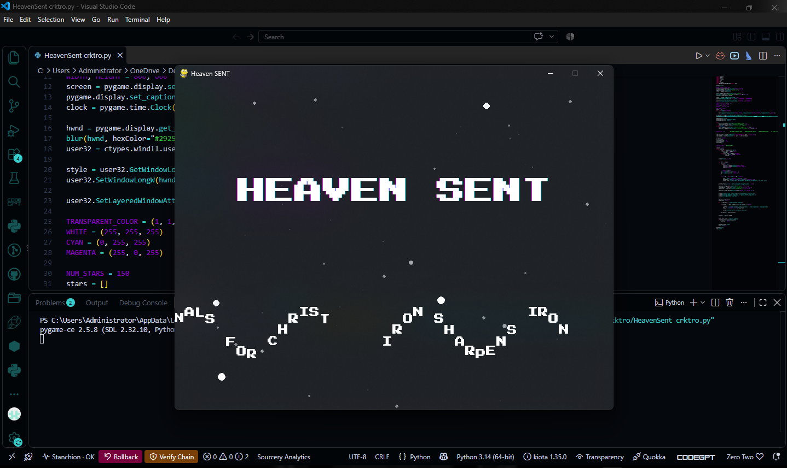

# Heaven-Sent-UI-System
# 🌌 HEAVEN SENT - Interactive Object-Oriented UI System

### 🛠️ Technology Stack: Python, Pygame, Object-Oriented Programming (OOP)

## 📌 Project Overview
This repository features a custom-built, real-time graphical application developed in Python utilizing the Pygame framework. Originally conceptualized around community small-group structures, the application showcases advanced state machine logic, real-time particle rendering, and customized text layout rendering pipelines. 

## 🏗️ Technical Highlights & Logic Implementation
* **Object-Oriented Architecture:** Programmed using modular, reusable Python classes to manage game assets, dynamic screen states, and structural system configurations.
* **Real-Time Render Loops:** Engineered a high-performance frame-rate execution cycle to manage active screen updates and smooth color transitions without system bottlenecks.
* **AI-Assisted Integration:** Demonstrated advanced workflow optimization by leveraging generative AI assistants to debug code alignment, streamline resource integration, and refine vector mechanics.
* **Dynamic Physics Elements:** Coded automated system elements, including randomized background particle generation arrays that run smoothly alongside active text interfaces.

## 🚀 Key Professional Skills Demonstrated
1. **Full Lifecycle Software Development:** Moving an initial abstract concept from rapid layout prototyping into a stable, fully executable user application.
2. **Advanced Prompt Engineering:** Utilizing modern AI developer tools to rapidly optimize script performance, manage logical errors, and expand core system feature sets.

---
*Developed by Jzeus222 | BCom Marketing Management & Analytics*
